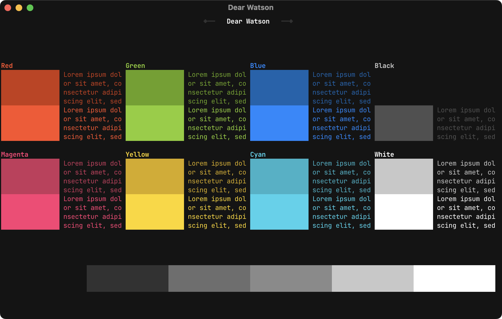

# Dear Watson - Terminal Colour Scheme

Modified version of `Elementary`, originally the default terminal palette of [elementary OS](https://elementary.io/).

See [INSTALL_GUIDE.md](INSTALL_GUIDE.md) to install the colour scheme.

The actual colour values are:

| Color          | ANSI | Hex       | Sample                                                   |
|----------------|:----:|-----------|----------------------------------------------------------|
| Black          |   1  | `#141414` |  |
| Red            |   2  | `#C83915` |  |
| Green          |   3  | `#69A018` |  |
| Yellow         |   4  | `#D7AA00` |  |
| Blue           |   5  | `#0064AE` |  |
| Magenta        |   6  | `#C8365B` |  |
| Cyan           |   7  | `#27B3C8` |  |
| White          |   8  | `#C8C8C8` |  |
| Bright Black   |   9  | `#505050` |  |
| Bright Red     |  10  | `#FF4E26` |  |
| Bright Green   |  11  | `#8BCE27` |  |
| Bright Yellow  |  12  | `#FFD600` |  |
| Bright Blue    |  13  | `#0089FF` |  |
| Bright Magenta |  14  | `#FF3B74` |  |
| Bright Cyan    |  15  | `#2FD3EC` |  |
| Bright White   |  16  | `#FFFFFF` |  |
| Background     |      | `#141414` |  |
| Foreground     |      | `#C8C8C8` |  |
| Cursor         |      | `#F2F2F2` |  |

\
\
\
\
\
\
\
